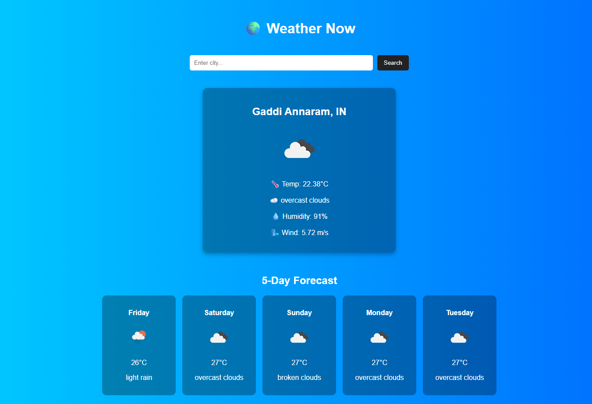
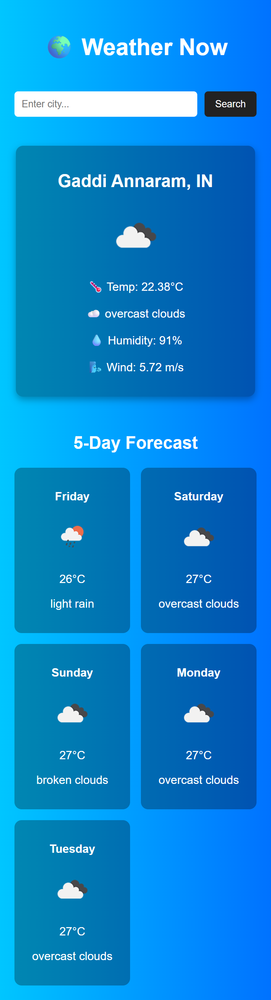

# Weather Now

Weather Now is a simple, modern React.js web application that provides **real-time weather updates** and a **5-day forecast** using the [OpenWeather API](https://openweathermap.org/).  

It automatically detects the user’s location (with browser geolocation) and allows searching for weather in any city worldwide.  

---

## Table of contents

- [Features](#Features)
- [Tech Stack](#TeckStack)
- [Project Structure](#ProjectStructure)
- [Setup Instructions](#SetupInstructions)
-[screenShots](#screenShots)
- [Author](#author)

## Features

- **Auto-detect current location** (via geolocation)  
- **Search weather by city name**  
- **5-day forecast at noon each day**  
- **Responsive & modern UI** with gradient background  
- Shows **temperature, humidity, wind speed, and conditions**  
- Weather icons from OpenWeather  

---

## Tech Stack

- **React.js** – Frontend framework  
- **Axios** – For API requests  
- **OpenWeather API** – Weather data provider  
- **CSS** – For Styling & Responsive UI  

---

## Project Structure

weather-now/ \
|-- src/ \
│ |-- components/ \
| | |-- SearchBar.js \
│ │ |-- WeatherCard.js  \
│ │ |-- Forecast.js  \
│ |-- App.js  \
│ |-- api.js  \
│ |-- App.css \
│ |-- index.js  \
|-- public/  \
|-- .env  

---

## Links

- [**Live Site URL**](https://shrikanth-dev.github.io/Weather-Now/)

## Setup Instructions

### 1 Clone the repository
```bash
git clone https://github.com/your-username/weather-now.git
cd weather-now

```
### 2 Install dependencies
```bash
npm install
```
### 3 Add API Key

Create a **.env** file in the root directory 

```env

REACT_APP_WEATHER_API_KEY=your_api_key_here

```

### 4 Run the app locally
```bash
npm start
```

### 5 Build for production
```bash
npm run build
```

## Screenshots



## Author

- Shrikanth Dev
- [GitHub](https://github.com/shrikanth-dev)
- Portfolio - [shrikanthdev-portfolio](https://shrikanthdev-portfolio.vercel.app/)


